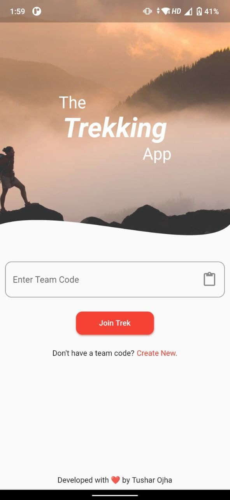
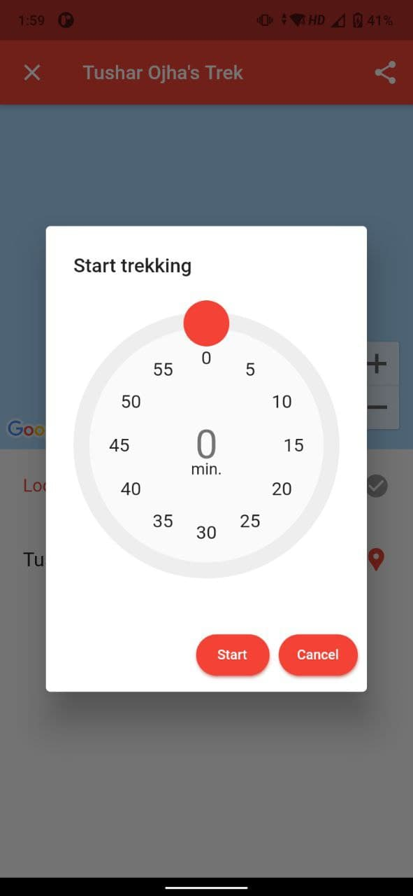
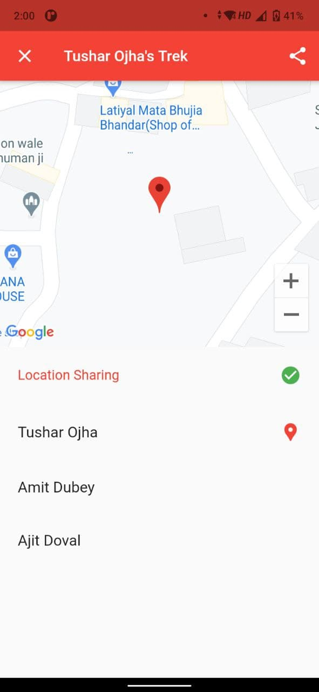

# The Trekking App

A simple & secure location sharing platform. With features including:
* User can invite other users to have access to his/her location via _passkey_ or _dynamic link_.
* Timer for location sharing
* User can handover the beacon to another user.
* Automatically deletes the trekking record (including location & members list) when the beacon carrier exits the app or quits.
* Multiple instances of location sharing can be done through a single trekking record.

|         Home Screen         |                 Start location sharing                  |            Trekking Screen             |
| :-------------------------: | :-----------------------------------------------------: | :------------------------------------: |
|  |  |  |

## Download APK

I am planning to improve the app and land it on my [Play Store Account](https://play.google.com/store/apps/developer?id=Tushar+Ojha) very soon till then APK for the current version can be downloaded from [here](./app-release.apk)

## Setup & Installation

Setup the project by following steps:

* Create a firebase project & download `google_services.json` file
* Add `google-services.json` to `android/app/` directory
* Enable `Google Maps SDK for Android` for your project on google cloud and generate an API key
* Add the generated API key to `android/app/AndroidManifest.xml` file as suggested inside the file.

Running the project:

```
    flutter pub get
    flutter run lib/main.dart
```

## Contributions

Contributions for improving the app are highly appreciated. 

* Make sure to create an issue with proper discussion before working on it.
* Format all the dart files properly.
  
